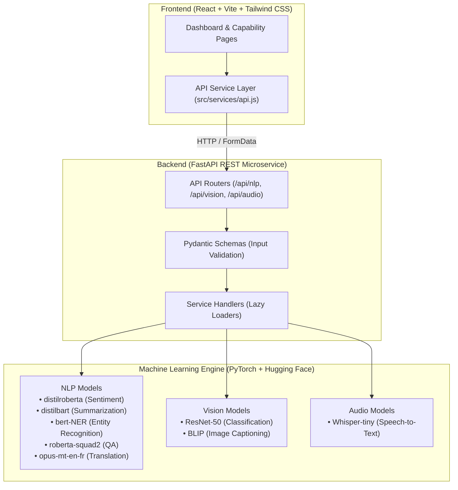

# AI Intelligence Studio 🧠⚡

> **A Portfolio-Grade, Multi-Modal Artificial Intelligence Workspace**  
> *Transforming standalone Hugging Face experiment scripts into an enterprise-level, production-ready full-stack application.*

---

## 📌 Executive Summary

**AI Intelligence Studio** solves a practical problem in applied artificial intelligence: instead of interacting with isolated Python scripts for different AI tasks, users have **one unified web workspace** to submit text, images, or audio files and perform real-time model analysis.

The platform integrates **8 Hugging Face Transformer models** spanning **Natural Language Processing (NLP)**, **Computer Vision**, and **Speech Audio Analysis**, exposed via a high-performance **FastAPI** backend and an intuitive **React + Tailwind CSS** frontend dashboard.

---

## 🏗 System Architecture



---

## 🔬 Learning vs. Production Architecture

This repository documents the complete software engineering journey from experimental learning to production architecture:

- **`learning/` Folder:** Contains the original working reference scripts (`summarization.py`, `ner.py`, `speech_to_text.py`, etc.). These serve as direct baseline experiments and remain completely untouched.
- **`backend/app/services/` Modules:** The refactored production layer. Abstracted model pipelines with lazy-loading initializers, error boundaries, mono audio downmixing, and memory optimization.

---

## 🤖 Integrated AI Capabilities Catalog

| Capability | Modality | Model ID | Framework | Real-Time Output |
| :--- | :--- | :--- | :--- | :--- |
| **Financial Sentiment** | NLP | `mrm8488/distilroberta-finetuned-financial-news-sentiment_v2` | PyTorch / Transformers | Sentiment label (`Positive`/`Negative`/`Neutral`), confidence, & probability scores. |
| **Text Summarization** | NLP | `sshleifer/distilbart-cnn-12-6` | PyTorch / Transformers | Abstractive high-density summaries with configurable token length parameters. |
| **Entity Recognition (NER)** | NLP | `dslim/bert-base-NER` | PyTorch / Transformers | Extracted entity word spans, type groups (`ORG`, `PER`, `LOC`), and confidence percentages. |
| **Question Answering** | NLP | `deepset/roberta-base-squad2` | PyTorch / Transformers | Extracted exact text answers and start/end character offsets from context passages. |
| **Translation (EN → FR)** | NLP | `Helsinki-NLP/opus-mt-en-fr` | PyTorch / Transformers | Fluent French translation of English input sentences. |
| **Image Classification** | Vision | `microsoft/resnet-50` | PyTorch / Transformers | Top ImageNet visual class predictions and confidence percentages for uploaded images. |
| **Image Captioning** | Vision | `Salesforce/blip-image-captioning-base` | PyTorch / Transformers | Natural language text descriptions generated from uploaded images. |
| **Speech-to-Text** | Audio | `openai/whisper-tiny` | PyTorch / SoundFile | Audio transcription from uploaded audio files (`.wav`, `.mp3`, `.flac`). |

---

## 📂 Project Structure

```text
ai-intelligence-studio/
├── learning/                     # Original baseline experiment reference scripts
│   ├── financial_sentiment.py
│   ├── summarization.py
│   ├── ner.py
│   ├── question_answering.py
│   ├── translation.py
│   ├── image_classification.py
│   ├── image_captioning.py
│   └── speech_to_text.py
├── backend/                      # FastAPI Microservice Backend
│   ├── app/
│   │   ├── api/routes/           # Router modules (nlp.py, vision.py, audio.py)
│   │   ├── core/                 # App configuration & model registries (config.py)
│   │   ├── schemas/              # Pydantic request/response schemas
│   │   ├── services/             # Dynamic AI inference handlers
│   │   └── utils/                # Audio & Image preprocessing utilities
│   ├── requirements.txt          # Pinned backend dependencies
│   └── README.md
├── frontend/                     # React + Vite + Tailwind CSS Dashboard
│   ├── src/
│   │   ├── components/           # Nav & Responsive Layout (Layout.jsx)
│   │   ├── pages/                # Workspace UI Pages (Dashboard + 8 Capabilities)
│   │   └── services/             # Clean API client (api.js)
│   ├── package.json              # Frontend package manifest
│   ├── tailwind.config.js        # Styling configuration
│   ├── vite.config.js            # Build configuration
│   └── README.md
├── tests/                        # Automated Backend Unit Test Suite
│   └── backend/                  # 22 Test cases covering routes & health checks
├── .env.example                  # Environment configuration template
├── .gitignore                    # Production gitignore rules
└── README.md                     # Master Repository Documentation
```

---

## 🚀 Getting Started Guide

### Prerequisites
- Python 3.10+
- Node.js 18+ and npm 9+

---

### 1. Backend Setup (FastAPI)

1. Navigate to the backend directory:
   ```bash
   cd ai-intelligence-studio/backend
   ```
2. Activate your virtual environment and install dependencies:
   ```bash
   pip install -r requirements.txt
   ```
3. Launch the FastAPI server:
   ```bash
   python -m uvicorn app.main:app --host 127.0.0.1 --port 8000 --reload
   ```
   *The server starts at `http://127.0.0.1:8000` with interactive API docs at `http://127.0.0.1:8000/docs`.*

---

### 2. Frontend Setup (React + Vite)

1. Open a new terminal and navigate to the frontend directory:
   ```bash
   cd ai-intelligence-studio/frontend
   ```
2. Install frontend dependencies:
   ```bash
   npm install
   ```
3. Start the development server:
   ```bash
   npm run dev
   ```
   *Access the web studio at `http://localhost:3000` (or `http://localhost:5173`).*

---

### 3. Running Automated Test Suite

Verify system health and router integrity across all 22 test cases:
```bash
python -m unittest discover -s tests/backend -p "test_*.py"
```

---

## 📡 API Endpoint Reference & Sample Payloads

### 1. Financial Sentiment Analysis
- **`POST /api/nlp/sentiment`**
- **Request Body:**
  ```json
  {
    "text": "Operating revenue grew by 18% year-over-year while operating margins expanded."
  }
  ```
- **Response:**
  ```json
  {
    "label": "positive",
    "score": 0.9996,
    "probabilities": {
      "negative": 0.0002,
      "neutral": 0.0002,
      "positive": 0.9996
    }
  }
  ```

### 2. Text Summarization
- **`POST /api/nlp/summarize`**
- **Request Body:**
  ```json
  {
    "text": "The central bank announced a surprise 50 basis point rate reduction today...",
    "max_length": 60,
    "min_length": 20
  }
  ```
- **Response:**
  ```json
  {
    "summary": "The central bank announced a 50 basis point interest rate cut today to support liquidity."
  }
  ```

### 3. Speech-to-Text Transcription
- **`POST /api/audio/transcribe`**
- **Request:** `multipart/form-data` with `file` (WAV, MP3, FLAC)
- **Response:**
  ```json
  {
    "text": "Welcome to AI Intelligence Studio. This is a speech audio transcription test."
  }
  ```

---

## 🏆 Key Quality & Engineering Highlights

- **Zero Hardcoded Dummy Responses:** Every prediction is computed live by Hugging Face neural networks.
- **Memory Efficient:** Lazy-loads PyTorch models into RAM/VRAM only upon the first request.
- **Robust CORS Engine:** Configured with `allow_origin_regex` to support cross-origin preflight requests from any localhost frontend port.
- **Responsive Dark Theme UI:** Designed with Tailwind CSS, category color indicators, loading spinners, and reactive error boundaries.

---

## 📄 License
Distributed under the MIT License. See `LICENSE` for more information.
